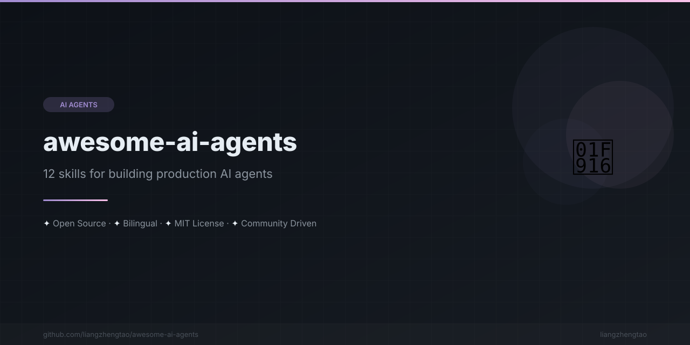

[English](README.md) | [中文](README.zh.md) | [日本語](README.ja.md) | [Français](README.fr.md) | [Español](README.es.md) | [العربية](README.ar.md) | [한국어](README.ko.md) | [Português](README.pt.md) | [Русский](README.ru.md) | [Deutsch](README.de.md)

<div align="center">



</div>


# Awesome AI Agents

[](https://awesome.re)
[](LICENSE)
[](CONTRIBUTING.md)
[](https://github.com/liangzhengtao/awesome-ai-agents)

---

> **توقف عن بناء روبوتات الدردشة الأساسية. 12 مهارة لبناء وكلاء ذكاء اصطناعي جاهزين للإنتاج.**

مجموعة منتقاة من المهارات المُجربة والموثوقة لبناء وكلاء الذكاء الاصطناعي — من استدعاء الأدوات في الوكيل الواحد إلى التنسيق بين الوكلاء المتعددين. كل مهارة هي دليل كامل وجاهز للنسخ واللصق يشمل مخططات معمارية، قوالب كود، أنماط، وأخطاء شائعة.

---

## لماذا هذا المشروع؟

منظومة وكلاء الذكاء الاصطناعي في 2026 مجزأة — LangChain، AutoGen، CrewAI، MCP، حلول مخصصة — كل منها بواجهات برمجة وأنماط مختلفة. يصفي هذا المشروع **المهارات الأساسية** التي يحتاجها كل مطور وكلاء، بغض النظر عن اختيار الإطار.

---

## جدول المهارات

### أُطُم الوكلاء

| # | المهارة | الوصف | المسار |
|---|---------|-------|--------|
| 1 | **LangChain Agents** | بناء وكلاء باستخدام LangChain و LangGraph | [`skills/Agent框架/langchain-agents.md`](skills/Agent框架/langchain-agents.md) |
| 2 | **AutoGen Multi-Agent** | محادثات متعددة الوكلاء باستخدام Microsoft AutoGen | [`skills/Agent框架/autogen-multiagent.md`](skills/Agent框架/autogen-multiagent.md) |
| 3 | **CrewAI Agents** | تنسيق الوكلاء القائم على الأدوار باستخدام CrewAI | [`skills/Agent框架/crewai-agents.md`](skills/Agent框架/crewai-agents.md) |
| 4 | **Custom Agents** | بناء وكلاء من الصفر بدون أُطُم | [`skills/Agent框架/custom-agents.md`](skills/Agent框架/custom-agents.md) |

### استخدام الأدوات

| # | المهارة | الوصف | المسار |
|---|---------|-------|--------|
| 5 | **Function Calling** | استدعاء الوظائف واستخدام الأدوات عبر المزودين | [`skills/工具调用/function-calling.md`](skills/工具调用/function-calling.md) |
| 6 | **MCP Integration** | تكامل خوادم بروتوكول سياق النموذج | [`skills/工具调用/mcp-integration.md`](skills/工具调用/mcp-integration.md) |
| 7 | **API Orchestration** | دمج عدة APIs في سير عمل الوكلاء | [`skills/工具调用/api-orchestration.md`](skills/工具调用/api-orchestration.md) |

### أنظمة الذاكرة

| # | المهارة | الوصف | المسار |
|---|---------|-------|--------|
| 8 | **RAG Memory** | ذاكرة التوليد المعزز بالاسترجاع للوكلاء | [`skills/记忆系统/rag-memory.md`](skills/记忆系统/rag-memory.md) |
| 9 | **Long-Term Memory** | المعرفة الرسومية والذاكرة طويلة المدى | [`skills/记忆系统/long-term-memory.md`](skills/记忆系统/long-term-memory.md) |

### الوكلاء المتعددون

| # | المهارة | الوصف | المسار |
|---|---------|-------|--------|
| 10 | **Agent Communication** | بروتوكولات المراسلة بين الوكلاء | [`skills/多Agent协作/agent-communication.md`](skills/多Agent协作/agent-communication.md) |
| 11 | **Task Decomposition** | تقسيم المهام المعقدة إلى مهام فرعية | [`skills/多Agent协作/task-decomposition.md`](skills/多Agent协作/task-decomposition.md) |
| 12 | **Agent Orchestration** | تنسيق عدة وكلاء في سير العمل | [`skills/多Agent协作/agent-orchestration.md`](skills/多Agent协作/agent-orchestration.md) |

---

## البدء السريع

### الاستخدام مع Cursor

1. استنسخ هذا المستودع:
   ```bash
   git clone https://github.com/liangzhengtao/awesome-ai-agents.git
   ```
2. افتح Cursor ← الإعدادات ← القواعد ← أضف `awesome-ai-agents/skills/` كسياق
3. اسأل Cursor: *"اقرأ مهارة langchain-agents وابنِ لي وكيلاً مع بحث ويب"*

### الاستخدام مع Claude Code

1. استنسخ هذا المستودع:
   ```bash
   git clone https://github.com/liangzhengtao/awesome-ai-agents.git
   ```
2. في مشروعك، ارجع إلى المهارة:
   ```bash
   # انسخ المهارة التي تحتاجها
   cp awesome-ai-agents/skills/Agent框架/custom-agents.md .claude/agents/
   ```
3. أو ارجع مباشرة:
   ```
   Read awesome-ai-agents/skills/工具调用/function-calling.md and implement it in my project
   ```

### الاستخدام مع Kimi Code

1. استنسخ هذا المستودع:
   ```bash
   git clone https://github.com/liangzhengtao/awesome-ai-agents.git
   ```
2. أضفه كدليل مهارات:
   ```bash
   cp -r awesome-ai-agents/skills/ ~/.agents/skills/ai-agents/
   ```
3. أو ارجع في المحادثة:
   ```
   Read the skill at awesome-ai-agents/skills/记忆系统/rag-memory.md and set up RAG for my project
   ```

### كمرجع

كل ملف مهارة مستقل. تصفح دليل المهارات، اختر ما تحتاجه، واتبع المخطط المعماري وقوالب الكود والأنماط.

---

## ما تحتويه كل مهارة

كل ملف مهارة يتبع نفس الهيكل:

- **متى تُستخدم** — مصفوفة قرارات واضحة لتحديد متى تنطبق المهارة
- **البنية المعمارية** — مخطط ASCII يوضح تصميم النظام
- **قوالب الكود** — كود Python جاهز للإنتاج، قابل للنسخ واللصق
- **الأنماط** — أنماط تصميم شائعة مع أمثلة الكود
- **الأخطاء الشائعة** — أشياء قد تسبب لك مشاكل (مع حلولها)
- **أنماط مُجربة** — حكمة إنتاجية مكتوبة بخبرة
- **انظر أيضاً** — إحالات مرجعية لمهارات ذات صلة

---

## مسار التعلم

### مبتدئ
```
Custom Agents → Function Calling → RAG Memory
```

### متوسط
```
LangChain Agents → MCP Integration → Long-Term Memory → Task Decomposition
```

### متقدم
```
AutoGen Multi-Agent → Agent Communication → Agent Orchestration → API Orchestration
```

---

## المساهمة

نرحب بالمساهمات! انظر [CONTRIBUTING.md](CONTRIBUTING.md) للإرشادات.

---

## الترخيص

هذا المشروع مرخص بموجب ترخيص MIT — انظر [LICENSE](LICENSE) للتفاصيل.

---

## انظر أيضاً

تحقق من مشاريع `awesome-*` الأخرى لدينا:

| المشروع | الوصف |
|---------|-------|
| [awesome-ai-agents](https://github.com/liangzhengtao/awesome-ai-agents) | مهارات بناء وكلاء الذكاء الاصطناعي |
| [awesome-llm-apps](https://github.com/liangzhengtao/awesome-llm-apps) | مجموعة تطبيقات مدعومة بنماذج LLM |
| [awesome-rag](https://github.com/liangzhengtao/awesome-rag) | تقنيات وتنفيذات RAG |
| [awesome-prompt-engineering](https://github.com/liangzhengtao/awesome-prompt-engineering) | أدلة وقوالب هندسة الأوامر |
| [awesome-ai-coding](https://github.com/liangzhengtao/awesome-ai-coding) | أدوات وممارسات البرمجة بالذكاء الاصطناعي |
| [awesome-gpt-store](https://github.com/liangzhengtao/awesome-gpt-store) | تطبيقات GPT Store منتقاة |
| [awesome-ai-api](https://github.com/liangzhengtao/awesome-ai-api) | أدلة تكامل APIs الذكاء الاصطناعي |
| [awesome-llm-fine-tuning](https://github.com/liangzhengtao/awesome-llm-fine-tuning) | تقنيات الضبط الدقيق لنماذج LLM |
| [awesome-vector-database](https://github.com/liangzhengtao/awesome-vector-database) | مقارنات وأدلة قواعد البيانات الشعاعية |
| [awesome-ai-safety](https://github.com/liangzhengtao/awesome-ai-safety) | موارد سلامة ومواءمة الذكاء الاصطناعي |
| [awesome-multimodal-ai](https://github.com/liangzhengtao/awesome-multimodal-ai) | تقنيات الذكاء الاصطناعي متعدد الوسائط |
| [awesome-open-source-llm](https://github.com/liangzhengtao/awesome-open-source-llm) | مجموعة نماذج LLM مفتوحة المصدر |

---

<div align="center">

**صُنع بعناية من أجل مجتمع وكلاء الذكاء الاصطناعي.**

[⬆ العودة للأعلى](#awesome-ai-agents)

</div>
